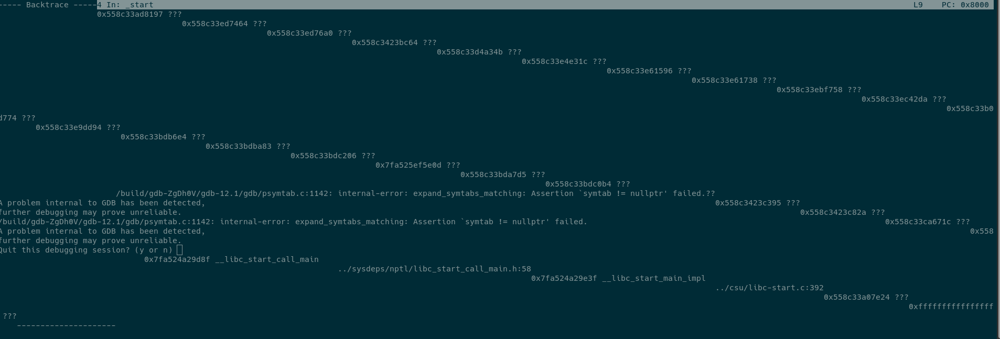
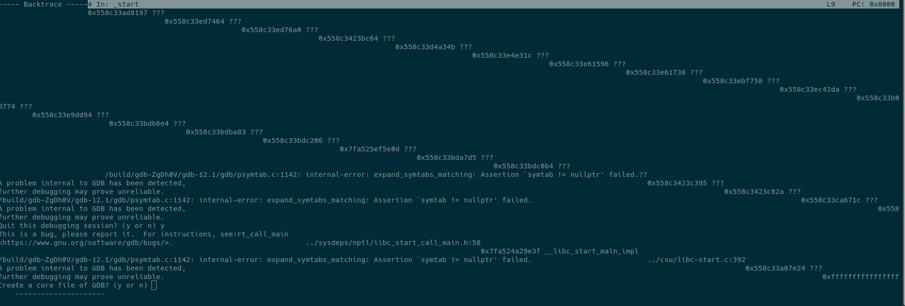

```
$ uname -a
Linux pop-os 6.0.6-76060006-generic #202210290932~1669062050~22.04~d94609a SMP PREEMPT_DYNAMIC Mon N x86_64 x86_64 x86_64 GNU/Linux
```

apt deps:


`sudo apt install qemu-user-static gdb-multiarch gcc-arm-linux-gnueabihf`

```
$ gdb-multiarch --version
GNU gdb (Ubuntu 12.1-0ubuntu1~22.04) 12.1
Copyright (C) 2022 Free Software Foundation, Inc.
License GPLv3+: GNU GPL version 3 or later <http://gnu.org/licenses/gpl.html>
This is free software: you are free to change and redistribute it.
There is NO WARRANTY, to the extent permitted by law.

$ gdb-multiarch --configuration
This GDB was configured as follows:
   configure --host=x86_64-linux-gnu --target=x86_64-linux-gnu
	     --with-auto-load-dir=$debugdir:$datadir/auto-load
	     --with-auto-load-safe-path=$debugdir:$datadir/auto-load
	     --with-expat
	     --with-gdb-datadir=/usr/share/gdb (relocatable)
	     --with-jit-reader-dir=/usr/lib/gdb (relocatable)
	     --without-libunwind-ia64
	     --with-lzma
	     --with-babeltrace
	     --with-intel-pt
	     --with-mpfr
	     --with-xxhash
	     --with-python=/usr (relocatable)
	     --with-python-libdir=/usr/lib (relocatable)
	     --with-debuginfod
	     --without-guile
	     --enable-source-highlight
	     --with-separate-debug-dir=/usr/lib/debug (relocatable)
	     --with-system-gdbinit=/etc/gdb/gdbinit
	     --with-system-gdbinit-dir=/etc/gdb/gdbinit.d

("Relocatable" means the directory can be moved with the GDB installation
tree, and GDB will still find it.)
```

Contents of `~/.gdbinit`:
```
tui new-layout arm {-horizontal asm 1 regs 1} 2 status 0 cmd 1
set auto-load safe-path /
```

To repro:
1. In one terminal run `make run`. This will start the binary with `qemu-arm-static` and wait for a gdb session to attach.
2. In another terminal run `make dbg`. This should start `gdb-multiarch` attached the the session in the first terminal.
3. In the gdb prompt, type `tui reg general`.

Expected result:

Actual result:

Then after entering `y` to the quit prompt:

After entering `y` to the Create core dump prompt:
```
Create a core file of GDB? (y or n) yAborted (core dumped)
    ---------------------                                 make: *** [Makefile:27: dbg] Error 134
                                                                                                %
```

The core dump is in this repo as `_usr_bin_gdb-multiarch.1000.crash`.

# Possible clue?
The issue seems to come from the `#` lines generated by compilation of the `.s` file from the `.S` file. If I remove the `#` lines from the `.s` file, the error stops occurring.